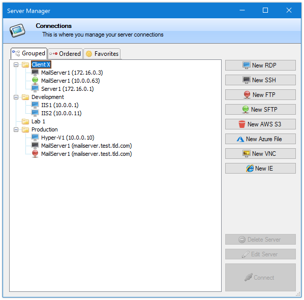
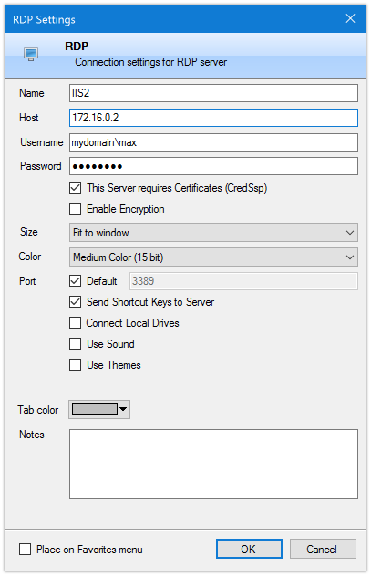
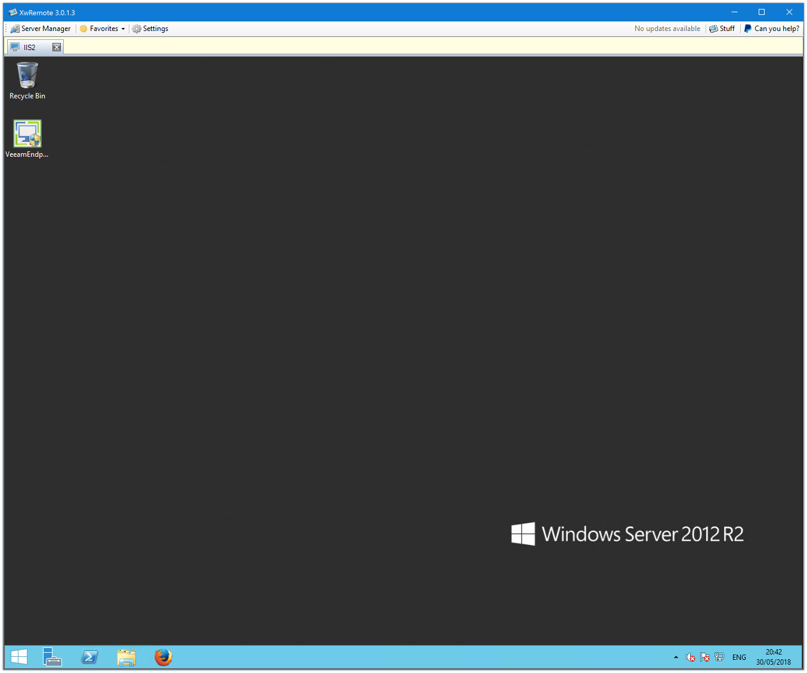
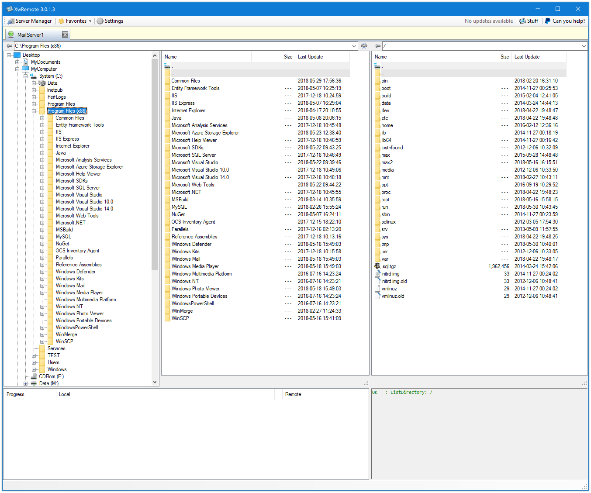
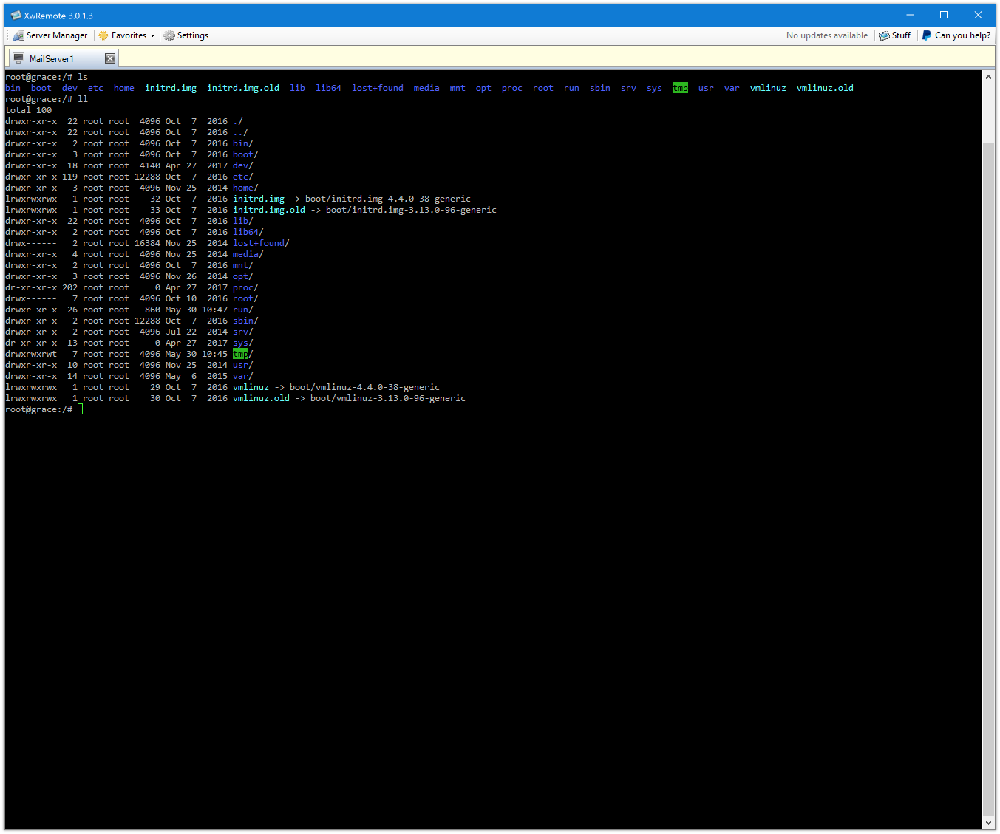

# XwRemote NG

XwRemote NG is a continuation of [maxsnts/XwRemote](https://github.com/maxsnts/XwRemote), maintained by [drivin](https://github.com/drivin).

This fork includes .NET Framework 4.8 builds, an embedded WebView2 browser,
updated build dependencies, compiler-warning fixes and browser integration tests.
The original project history and GPL-3.0 license are retained. Windows Server
2016 runtime acceptance remains pending. AD authorization is planned, not implemented.

Repository: https://github.com/drivin/xwremote-ng.
The executable and configuration filenames remain `XwRemote` to preserve existing installations.

How do i eliminate the need for many applications and the consequent open and close merry-go-round?

##### For now it supports:
 - RDP 
 - SSH
 - FTP 
 - SFTP
 - AWS S3 Buckets
 - Azure File Storage
 - VNC 
 - Embedded web browser (Microsoft Edge WebView2 / Chromium)
 - Master password

The functionality is not the most complete but it will increase over time.
There is always a balance between "complete" and "simple" so...

I will try to include new features as time allows.

Anyway, if there is anything that this could do better, let me know!

##### Embedded web browser

Web connections open inside XwRemote using WebView2. Existing `IE` connection
records and HTML login field IDs remain compatible; no configuration migration
is required. The old IE engine and browser-emulation registry writes are removed.

Install the [Microsoft Edge WebView2 Evergreen Runtime](https://developer.microsoft.com/en-us/microsoft-edge/webview2/)
on each machine running XwRemote, including Windows Server 2016 with Desktop
Experience. The NuGet SDK and native loaders are included in the build output;
the browser runtime is a separate prerequisite and receives its own updates.
Distribute the entire output directory, including the `runtimes` subdirectory.
If the runtime is missing, the browser tab displays an installation message.

- HTTP and HTTPS URLs, including explicit ports, are supported. Addresses without
  a scheme use HTTP for compatibility; enter `https://` explicitly for HTTPS.
- Basic HTTP authentication uses the browser authentication API. Credentials are
  not inserted into URLs. After a rejected automatic attempt, use the browser's
  authentication dialog.
- HTML auto-login uses the configured element IDs and emits input/change events.
  It runs after navigation completes. Forms rendered later by a web application,
  iframe logins, MFA and cross-origin identity providers may require manual login.
- Automatic credentials are restricted to the configured scheme, host and port.
  Cross-origin form actions are rejected. Certificate errors are not bypassed.
- New-window links open in the current embedded tab. Workflows requiring a separate
  popup window may behave differently.
- Browser profiles/cookies are stored per connection/account under
  `%LOCALAPPDATA%\XwRemote\WebView2`. Browser password saving is disabled.

Build with `powershell -ExecutionPolicy Bypass -File .\build.ps1`.
Run local browser integration checks with
`powershell -ExecutionPolicy Bypass -File .\tests\Test-Browser.ps1`.
These checks use loopback test pages, not saved connections or credentials.
Windows Server 2016 runtime acceptance still needs to be performed on that OS.

##### Server Manager 

##### Example of server configuration (different configurations for different protocols) 

##### RDP session

##### SFTP connection (all file connectors use the same interface, FTP, SFTP, AWS S3, Azure)

##### Remote SSH session

